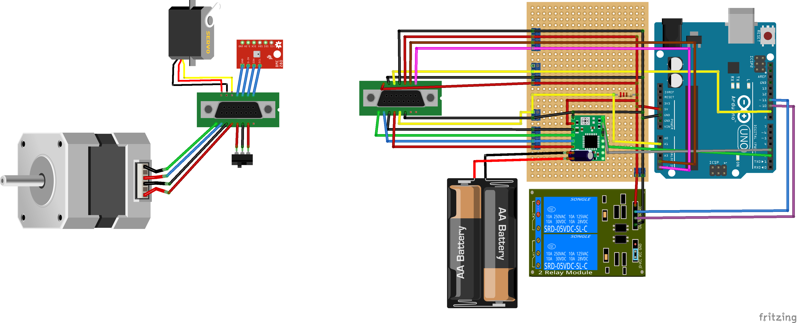

# Moving stage for Source and TPH sensor

NB: the image of the AA battery pack is referred to the 24V DC power supply!

## Basic instructions
Send a byte through serial port to Arduino

- **R**: Arduino replies with *temperature;pressure;humidity;VOC* [K,Pa,%,$\Omega$]
- **G**: Get the position of the stage with respect to the *zero*. Possible only after calibration
- **C**: do the calibration and stays to the *zero* position
- **P**: Set the position in mm from the *zero*. After that a prompt will ask you the position in mm. Not working without calibration. It is not possible to go to *zero* with this function, use the calibration procedure.
- **Z**: To send during any movement to stop it prematurely
- **W**: To return the detector where the Arduino is connected (KEG or MANGOlino)
- **Y**: Return if the calibration has already been done
- **K**: Reset the Arduino, equivalent to click the reset button

## TPH sensor

The sensor is a BME 680 that measure Temperature, pressure, humidity and VOC (volatile organic compounds).
Arduino talks to it via I2C. the sensor requires +5V and GROUND. **SDA and SCL are respectively connected to A4 and A5 analog input.**

## Moving stage

The stage is moving via a bipolar stepper motor. A switch on one edge of the guide is used to get the *zero* position via calibration procedure. The motor driver A4988 should be connected both to 5V and the 24V DC power supply.

Here the mapping of the cable from the motor to the controller.
| Name on A4988      | Other name | Color of the wire     |
| :---:        |    :----:   |          :---: |
| 1B      | A+       | Black   |
| 1A   | A-        | Green      |
| 2A   | B-        | Blue      |
| 2B   | B+        | Red      |

Remember to connect in parallel to the 24V a 100$\mu$F capacitor to avoid to burn the controller.
We selected 470 $\Omega$ for the resistance for the switch.

## Mapping of the 15pin parallel cable for the Vessel feedthroug

To enter in the vacuum vessel we used some connector with 15 pins. Here the mapping:

| Pin Number      | Connection |
| :---:        |    :----:   |
| 1      | 1A       |
| 2      | 2A       |
| 3      | 1B       |
| 4      | 2B       |
| 5      | Switch Ground       |
| 6      | Switch -       |
| 7      | VCC 5V (BME680)       |
| 8      | GND (BME 680)      |
| 9      | NC       |
| 10      | NC       |
| 11     | NC       |
| 12      | NC       |
| 13      | Switch +       |
| 14      | SCL       |
| 15      | SDA       |

